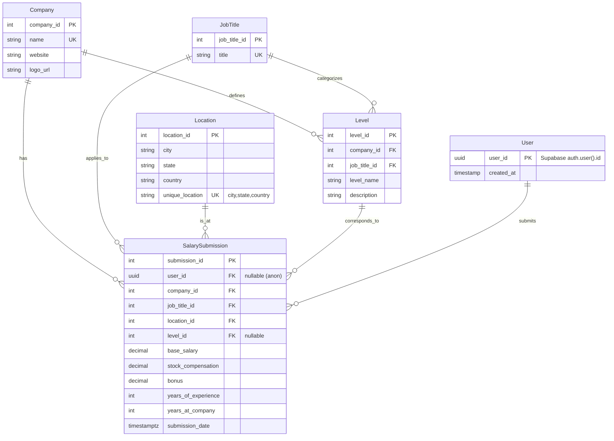

# Product Requirements Document (PRD)

**Product:** Salary Transparency Platform
**Version:** 1.1 (Next.js + Supabase)
**Date:** 2025‑09‑27

---

## 0) Change Log (from v1.0)

* **Stack change:** Frontend/Backend consolidated into **Next.js (App Router)** deployed on **Vercel**; data/auth/storage on **Supabase** (Postgres + Auth + Storage + RLS).
* **Data model:** `Level` now references **`Company` and `JobTitle`** (unique by `(company_id, job_title_id, level_name)`).
* **APIs:** Use **Next.js Route Handlers** + **Server Actions** for CRUD; no separate Spring Boot service for MVP.
* **Security:** Supabase **Row Level Security (RLS)** policies for public reads and controlled writes; anonymous contribution supported.
* **Deployment:** Single‑repo, zero‑ops MVP on Vercel; **optional later** migration path to AWS (free‑tier friendly) documented.

**Summary of this step:** We aligned the PRD with an ultra‑fast 48‑hour MVP path while preserving long‑term data integrity and growth options.

---

## 1) Introduction

We are building a website that delivers transparent, comprehensive salary information for technology engineers—helping them make informed career decisions and negotiate fair compensation. This MVP focuses on speed to value, clean UX, and a data model that scales.

**Why now:** Engineers—especially in underserved markets—need trustworthy salary benchmarks. Our platform surfaces real submissions, company‑specific levels, and contextual filters by title, location, and experience.

---

## 2) Purpose & Vision

**Purpose:** Provide transparent, high‑quality salary data and context (levels, experience, location) for tech roles.
**Vision:** Become the most trusted salary transparency resource for tech, starting with an MVP that’s fast to ship, easy to contribute to, and pleasant to browse.

---

## 3) Scope (MVP in 48h)

**Included:**

* **Homepage:** Tabs by **Job Title** (e.g., Software Engineer, Data Scientist, PM); recent salaries; top companies; level chips per title.
* **Search & Filters:** Job Title, Company, Location, YoE, Level.
* **Contribution:** Anonymous salary submission (Base, Bonus, Stock, YoE, level linkage).
* **Company Page:** Levels per title, salary distribution, recent entries.
* **Auth (optional day‑1):** Github and google login; `user_id` on submission if logged in.

**Excluded (MVP):** Admin tools, moderation queue, import pipelines, advanced analytics, CSV export.

---

## 4) Key Features

### 4.1 Search & Discovery

* Global search with debounced suggestions for Job Title, Company, and Location.
* Filters: Years of Experience (range), Level (dependent on company + title), Date range.
* Pagination/Infinite scroll.

### 4.2 Job Category Tabs

* Predefined high‑value titles on the homepage.
* Each tab shows: Latest salaries, top paying companies, and level chips.

### 4.3 Salary Display

Each row: Company, Location, Title, Level, YoE, Base, Bonus, Stock, Total Comp, Date.
Interactive visuals: distribution and percentiles.

### 4.4 Contribution (Anonymous OK)

* Multi‑step form with dependent selects: Company → Job Title → Level.
* Client‑side validation (Zod); server‑side validation in Server Actions.
* PII sanitized (no names, emails or IDs stored with the submission).

### 4.5 Levels Section

* Company‑specific levels **per job title** with description and expected ranges.
* Visual career path per company/title (simple ladder in MVP).

---

## 5) UX / UI

* **Design principles:** clarity, speed, low cognitive load, mobile‑first, accessible (WCAG AA).
* **Stack:** Tailwind CSS + shadcn/ui components; AG Grid or TanStack Table; Recharts/Tremor for charts.
* **Patterns:** Empty states, skeleton loaders, optimistic UI for submissions.

---

## 6) Technology Requirements (MVP)

* **App framework:** **Next.js (App Router)** with **TypeScript**.
* **Data/Auth/Storage:** **Supabase** (Postgres, Auth, Storage, RLS).
* **ORM/Query:** Drizzle ORM (or direct SQL) on the server; Supabase client in the browser for public reads.
* **APIs:** Next.js **Route Handlers** (`app/api/*/route.ts`) + **Server Actions** for secure mutations.
* **Deployment:** **Vercel** (free tier).
* **Observability:** Vercel Analytics, Supabase logs; simple error reporting.

> **Later (Scale on AWS, free‑tier eligible):** ECS on EC2 **t3.micro**, RDS **db.t3.micro**, CloudFront (free‑tier), ECR, Secrets Manager, CloudWatch. Preserve schema; lift Server Actions to a Spring Boot or NestJS service when needed.

---

## 7) Data Model & ERD

**Principles:** normalized schema; explicit `Level` association to both `Company` and `JobTitle`; durable audit fields (created_at via defaults).



**Uniqueness:** `unique (company_id, job_title_id, level_name)` on **Level**; `unique (city,state,country)` on **Location**.

---

## 8) Security & Privacy

* **RLS:**

    * `salary_submission`: `SELECT` for `public`; `INSERT` for `public` (anon allowed) with server‑side validation.
    * If user is authenticated, store `user_id` (`auth.uid()`).
* **Secrets:** Service role keys only on the server (Server Actions); never shipped to browser.
* **PII:** Do **not** store contributor emails on `salary_submission`.

---

## 9) API & Data Access (Next.js)

* **Reads (public):** Client calls Supabase anon key for `SELECT` via RLS.
* **Writes (secure):** Next.js **Server Actions** / **Route Handlers** perform validation then `INSERT` using server credentials (or call a Supabase Edge Function).

**Example endpoints**

* `GET /api/search` → proxy to parameterized SQL (or direct client query with RLS).
* `POST /api/submissions` → validate (Zod) → insert → return payload.
* `GET /api/companies/:id/levels?jobTitleId=` → list levels for title at company.

---

## 10) Performance, Caching & SEO

* **Rendering:** SSR where needed; otherwise SSG/ISR for static pages (company lists).
* **DB:** composite indexes (e.g., on `(job_title_id, company_id, location_id, level_id)`), limit/offset or keyset pagination.
* **SEO:** Proper titles/meta, canonical URLs, JSON‑LD for job titles/companies (later).

---

## 11) Observability & Quality

* Vercel Analytics, browser error toasts, API error logging.
* Basic e2e happy‑path tests (Playwright) post‑MVP.

---

## 12) Project Organization (Epics → Stories → Tasks)

**Project:** Salary Transparency Platform (STP)

### Epic: STP‑A – Foundation & Auth

* Story: github and google login.
* Tasks: Auth UI; server wiring; store `user_id` on submissions when available.

### Epic: STP‑B – Data & Schema

* Story: Create tables for Company, JobTitle, Location, Level, SalarySubmission.
* Tasks: DDL, indexes, seed SQL, RLS policies.

### Epic: STP‑C – Contribution Flow

* Story: As a user, I can submit a salary anonymously.
* Tasks: Form with dependent selects, Zod validation, Server Action for insert, success toast.

### Epic: STP‑D – Search & Homepage Tabs

* Story: Browse salaries by title tab with filters.
* Tasks: Search bar (debounced), results grid, charts, pagination.

### Epic: STP‑E – Company & Levels

* Story: View company page with levels per title and salary distribution.
* Tasks: API for `/companies/:id/levels`, charts, recent entries list.

---

## 13) Risks & Mitigations

* **Low data volume at launch** → Seed examples; nudge contributions post‑submit.
* **Abuse/Spam** → Rate limit by IP, basic heuristics, optional email verification.
* **Performance** → Indexes + pagination; offload heavy aggregates to materialized views later.

---

## 14) KPIs

* **Contribution:** # of new salary entries per week; submission conversion rate.
* **Engagement:** MAU, time on site, search/filter usage.
* **Satisfaction:** Feedback widget, NPS (later).

---

## 15) Appendix A – DDL (Postgres / Supabase)

```sql
create table job_title (
  job_title_id bigserial primary key,
  title text unique not null
);

create table company (
  company_id bigserial primary key,
  name text unique not null,
  website text,
  logo_url text
);

create table location (
  location_id bigserial primary key,
  city text not null,
  state text,
  country text not null,
  unique(city, state, country)
);

create table level (
  level_id bigserial primary key,
  company_id bigint not null references company(company_id),
  job_title_id bigint not null references job_title(job_title_id),
  level_name text not null,
  description text,
  unique(company_id, job_title_id, level_name)
);
create index idx_level_company_title on level(company_id, job_title_id);

create table salary_submission (
  submission_id bigserial primary key,
  user_id uuid null,
  company_id bigint not null references company(company_id),
  job_title_id bigint not null references job_title(job_title_id),
  location_id bigint not null references location(location_id),
  level_id bigint null references level(level_id),
  base_salary numeric not null,
  bonus numeric default 0,
  stock_compensation numeric default 0,
  years_of_experience int not null,
  years_at_company int default 0,
  submission_date timestamptz not null default now()
);
create index idx_submission_q on salary_submission(job_title_id, company_id, location_id, level_id);
```

### Appendix B – RLS (MVP)

```sql
alter table salary_submission enable row level security;

create policy public_read_salary_submission
on salary_submission for select
to public using (true);

create policy public_insert_salary_submission
on salary_submission for insert
to public with check (true);
```

---

## 16) Next Steps (48h Build Plan)

**Day 1:** Repo bootstrap; schema + RLS; homepage + search; contribution form baseline.
**Day 2:** Company page; charts; seed data; empty states; deploy to Vercel.

**Step Summary:** Ready to kick off a 48‑hour build with a single deployable stack and a schema that matches the UX (job title → levels → salaries).
